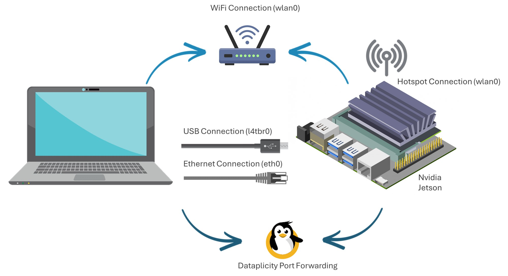
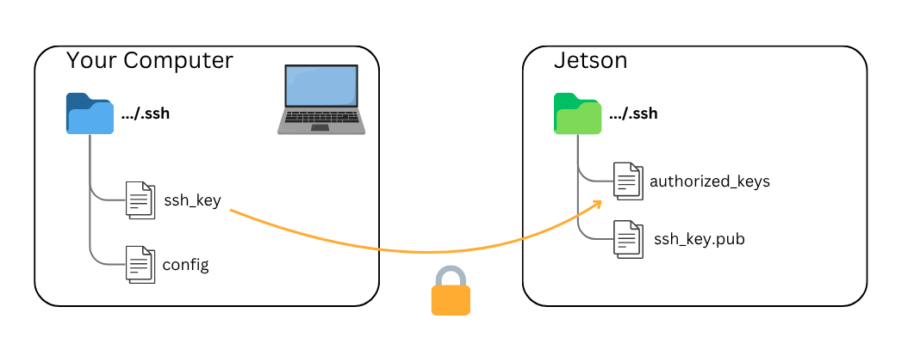
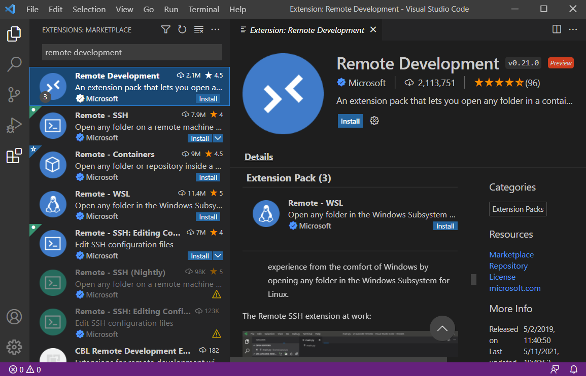
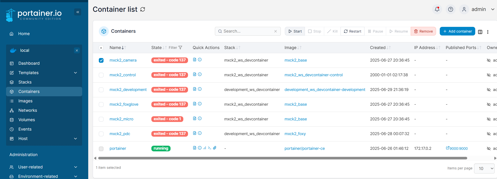

# MXCarkit ROS2 Humble Workspace

## Quick Start


Clone this repository.
```
git clone -b main https://github.com/william-mx/mxck2_ws.git ~/mxck2_ws
```

Make shell scripts and python files executable.
```
cd ~/mxck2_ws
sudo find . -type f -name '*.py' -o -name '*.sh' -exec chmod +x {} \;
sudo find . -type f -name '*.py' -exec dos2unix {} \;
```

Build docker image.
```
sudo docker build -t mxck2_humble .
```

## 0. MXcarkit Components and Wiring Overview


At the heart of the setup, we find the **NVIDIA Jetson**, which is the computing unit of the MXcarkit. A **USB Hub** is attached to it, expanding the maximum number of USB ports available. Both the USB Hub and the Jetson are powered by a **Powerbank**, ensuring a reliable power supply for operations. The Jetson operates with the JetPack SDK installed, utilizing `Ubuntu L4T (Linux for Tegra)` as its operating system, which is specifically optimized for high-performance computing and AI applications.

On the bottom left, the Microcontroller subsystem is presented. The core of this subsystem is an STM32 Nucleo microcontroller, which is connected via Micro USB to the Jetson. Depending on the ROS distribution utilized on the Jetson, there can be either `rosserial` for ROS or `micro-ROS` for ROS2 installed to facilitate communication. The Microcontroller is tasked with reading sensor data from the **RC Receiver**, the **Ultrasonic Sensors**, and the **IMU** (Inertial Measurement Unit), sending this data as ROS messages to the Jetson. In the reverse direction, it can receive messages from the Jetson to control the Lights via the **LED Driver**, demonstrating bidirectional communication capabilities.

On the bottom right, the VESC subsystem is illustrated. The **VESC**, an electronic speed controller, receives commands from the Jetson and controls the **BLDC motor** and the **servo motor** to drive the vehicle. This subsystem is powered by a **4S LiPo battery**. For optimal operation, the correct `VESC Firmware` must be flashed onto the VESC.

At the top right, the **Remote Controller** is noted for its role in sending a PWM Signal to the RC Receiver. This signal is then interpreted by the Microcontroller, which sends the data to the Jetson. Subsequently, the Jetson passes these commands to the VESC, prompting the vehicle to move.

Additionally, the setup includes the **RPLidar** and the **Intel D435i RealSense Camera** at the top, both of which are connected to the Jetson via USB. These sensors play critical roles in environmental perception, enabling advanced navigation and interaction capabilities for the MXcarkit.

This configuration illustrates a comprehensive and integrated approach to robotic vehicle design, leveraging the MXcarkit's modular components for a wide range of applications in robotics and autonomous systems.

## 1. System Software and Firmware Configuration Overview

In the components overview at the top, we identify three critical subsystems: the Jetson, the VESC, and the microcontroller. Each subsystem's corresponding operating software or firmware is denoted in gray at the bottom right.

- **Jetson Configuration**: 
  - We install **NVIDIA's JetPack SDK** on the Jetson, which utilizes **Ubuntu L4T** as the operating system. 
  - Depending on the JetPack version, it is Ubuntu 18.04 for JetPack versions below a specific threshold, and Ubuntu 20.04 for newer versions. 
  - To flash the Jetson, first check your hardware version and then select the latest supported [JetPack version](https://developer.nvidia.com/embedded/jetpack-archive). 
  - It is recommended to install it using the SDK Manager. [Installation Guide](https://docs.nvidia.com/sdk-manager/install-with-sdkm-jetson/index.html).

- **Microcontroller Configuration**: 
  - You must choose the right firmware depending on the ROS Distribution you plan to use on your Jetson, whether it's ROS or ROS2. 
  - The instructions for flashing the Jetson and the firmware can be found [here](https://github.com/william-mx/MXcarkit/tree/main/stm_nucleo).

- **VESC Configuration**: 
  - It's necessary to write the correct VESC firmware on our VESC and set the motor and application configuration appropriately to match our vehicle hardware. 
  - The instructions, firmware, and configurations can be found [here](https://github.com/william-mx/MXcarkit/tree/main/vesc).

## 2. Accessing the MXCarKit: Connection Guide

To communicate with the Carkit, make sure you're on the same network.You can connect to the Jetson via **USB**, **Ethernet**, **Wi-Fi**, or a **hotspot** — each assigns a different IP address.Use the `ifconfig` command on the Jetson to find the correct IP address for your current connection.




⚠️ Note: Connecting a screen, keyboard, and mouse directly for a desktop setup is possible but generally discouraged.  
This is mainly useful for initial configuration or troubleshooting and is not recommended for regular use.

### SSH Key Setup

It is best practice to configure SSH key-based authentication for secure and convenient access.
You'll need an SSH key and a configuration file — place them in the correct directory (usually `~/.ssh/`).



### Recommended Development Workflow

For a smooth development experience with IDE support, it is recommended to use the Visual Studio Code Remote Development extensions.  
This allows direct development on the Jetson inside Docker containers while providing full IDE features like terminal, debugging, and code navigation from your laptop.



## 4. Software Architecture Overview
The MXCarKit software is fully containerized to keep the system clean, modular, and easy to maintain. We avoid installing software directly on the host (Jetson) and instead use Docker to encapsulate all dependencies and services. Each container is responsible for a single concern, following best practices.

## 5. Base Docker Images
We use two distinct base images:
- `ros:humble-ros-base-jammy`: This is our primary image for handling sensor data and vehicle control. Although this image lacks native GPU hardware support, it is ideal for most packages because ROS 2 Humble provides compatibility and out-of-the-box support for tooling such as Foxglove.
- `ultralytics/ultralytics:latest-jetson-jetpack5`: This image is used for implementing driving functions that require GPU acceleration (e.g., neural networks for perception).

## 6. ROS Workspaces
We separate our logic into two ROS workspaces:
- `mxck2_ws`: Contains the core functionality.
  - `vehicle_control` package: Handles low-level control, including reading PWM signals from the remote controller and translating them for the VESC motor controller so the vehicle can move.
  - `mxck_run` package: Provides a centralized launch file (`mxck_run_launch.py`) that manages all sensors and actuators. `mxck_run` doesn’t contain any packages; it only has this launch file to start other nodes from a single point. You can initiate the launch file and pass arguments — by default, all arguments are set to false. Set them to true to start specific nodes as needed. For example:

    ```bash
    ros2 launch mxck_run mxck_run_launch.py run_camera:=true run_lidar:=true
    ```

    This command starts the camera and lidar nodes by setting their arguments to true.

- `development_ws`: Dedicated to driving functions that leverage GPU support and advanced perception algorithms. This workspace can be downloaded directly from the development branch using:

    ```bash
    git clone --recurse-submodules -b development_ws https://github.com/william-mx/mxck2_ws.git ~/development_ws
    ```

## 7. Container Management with Portainer
Portainer is configured to automatically run when the Jetson starts, so it is immediately available after boot. You can access the Portainer web interface by navigating to `http://<ip-address>:9000`, for example: `http://192.168.55.1:9000/`



Once logged in, you can conveniently start the sensors and motors directly from the Portainer interface by running individual containers, such as the `mxck2_camera` container to start the camera.

We use Portainer for user-friendly container orchestration and management. Following the principle that "each container should have only one concern and only one process," we deploy separate containers for individual functions. 

This modular approach improves reliability, observability, and user experience.

## 8. Web-based User Interface
With Portainer and our Docker setup, all major MXcarkit functions can be managed from a web browser. This allows users to start, stop, and monitor components easily without needing a development environment locally. The interface is mobile-friendly, so it works even from a smartphone.
